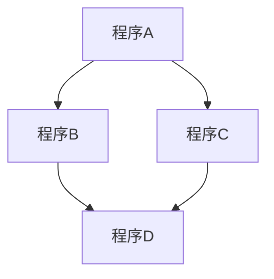
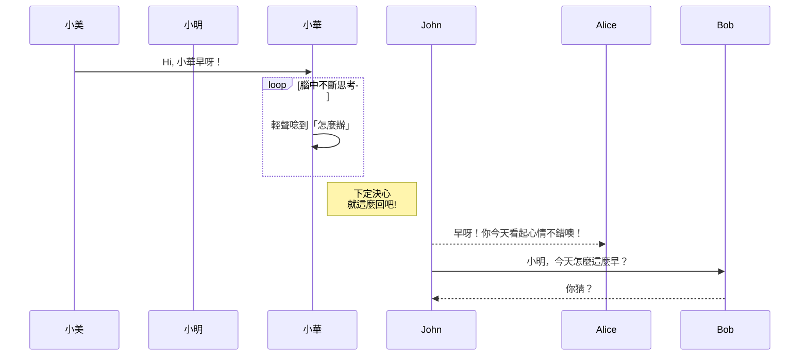

# mermaid
2022年新春大禮包， Github的**Markdown**開始支援**Mermaid**語法，以下就根據官方提供的語法來測試一下，經測試中文也沒有問題。   
參考資料來源：https://mermaid-js.github.io/mermaid/#/  
使用時只需在Mermaid指令前面加上一行「\`\`\`mermaid」表示程式開始，最後再加上一行「\`\`\`」來結束。  
這裡的「\`」符號指的是鍵盤左上角，ESC鍵下方那個按鍵。

## 流程圖 (Flowchat)  
```
graph TD;
    程序A-->程序B;
    程序A-->程序C;
    程序B-->程序D;
    程序C-->程序D;
```  

## 時序圖 (Sequence Diagram)
```
sequenceDiagram
    participant 小美
    participant 小明    
    小美->>小華: Hi, 小華早呀！
    loop 腦中不斷思考
        小華->>小華: 輕聲唸到「怎麼辦」
    end
    Note right of 小華: 下定決心 <br/>就這麼回吧!
    John-->>Alice: 早呀！你今天看起心情不錯噢！
    John->>Bob: 小明，今天怎麼這麼早？
    Bob-->>John: 你猜？
```

