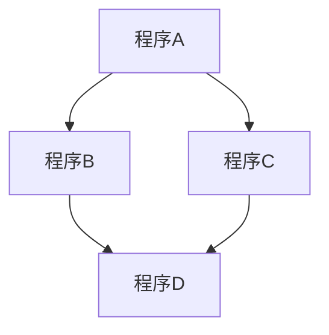

# mermaid
mermaid 語法測試  
參考資料來源：https://mermaid-js.github.io/mermaid/#/  

## 流程圖(Flowchat)  
```
graph TD;
    程序A-->程序B;
    程序A-->程序C;
    程序B-->程序D;
    程序C-->程序D;
```  

```mermaid
graph TD;
    程序A-->程序B;
    程序A-->程序C;
    程序B-->程序D;
    程序C-->程序D;
```
