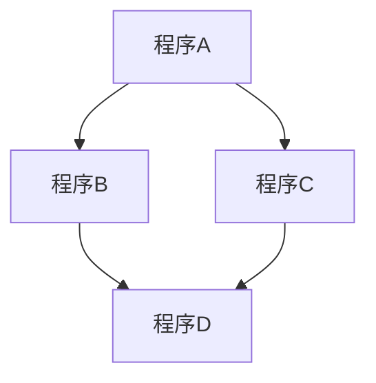
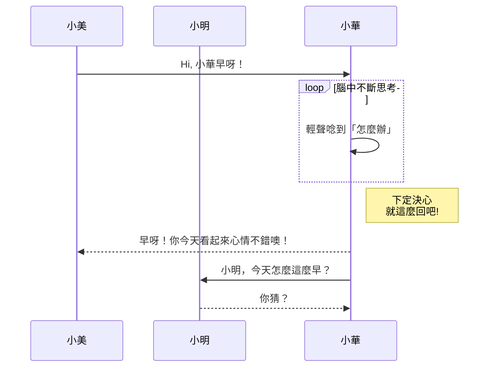
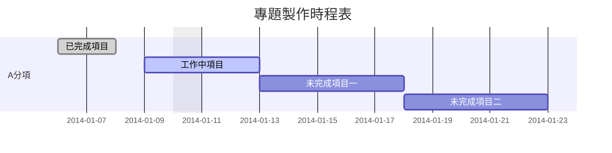
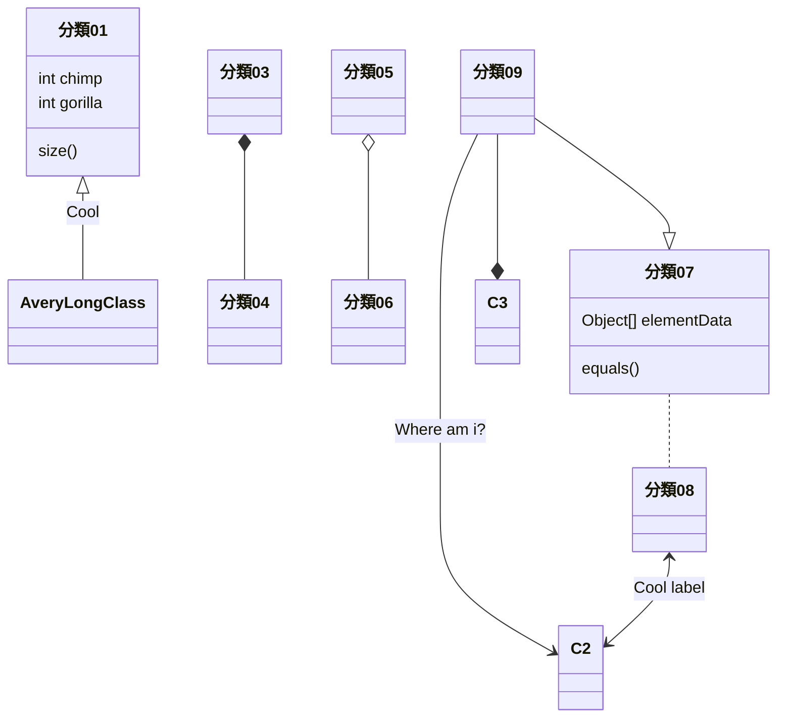
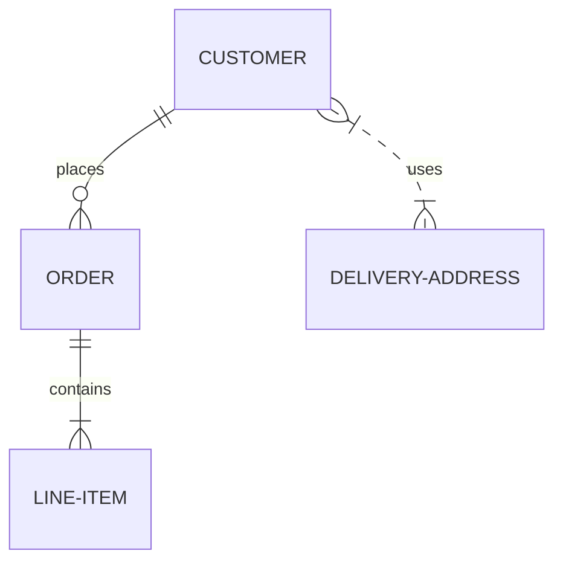
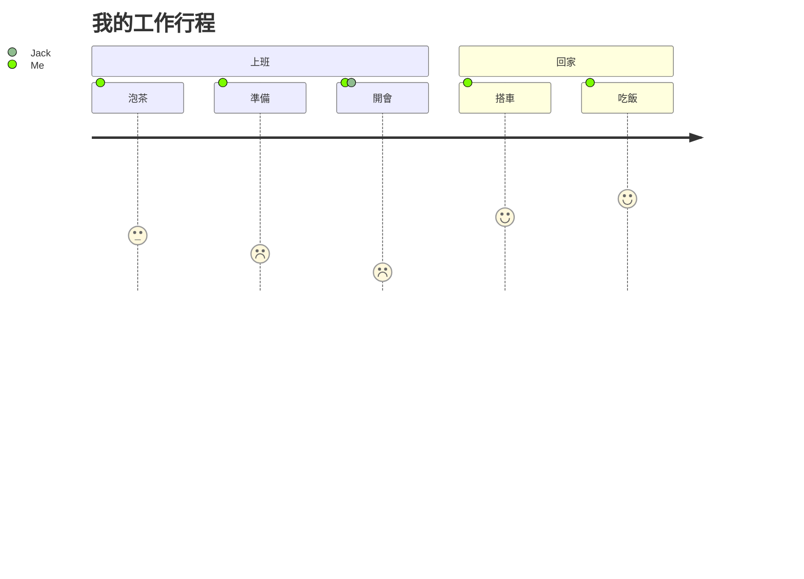

# mermaid
2022年新春大禮包， Github的**Markdown**開始支援**Mermaid**語法，以下就根據官方提供的語法來測試一下，經測試中文也沒有問題。   
參考資料來源：https://mermaid-js.github.io/mermaid/#/  
使用時只需在Mermaid指令前面加上一行「\`\`\`mermaid」表示程式開始，最後再加上一行「\`\`\`」來結束。  
這裡的「\`」符號指的是鍵盤左上角，ESC鍵下方那個按鍵。

## 流程圖 (Flowchat)  
```
graph TD;
    程序A-->程序B;
    程序A-->程序C;
    程序B-->程序D;
    程序C-->程序D;
```  



## 時序圖 (Sequence Diagram)
```
sequenceDiagram
    participant 小美
    participant 小明    
    小美->>小華: Hi, 小華早呀！
    loop 腦中不斷思考
        小華->>小華: 輕聲唸到「怎麼辦」
    end
    Note right of 小華: 下定決心 <br/>就這麼回吧!
    小華-->>小美: 早呀！你今天看起來心情不錯噢！
    小華->>小明: 小明，今天怎麼這麼早？
    小明-->>小華: 你猜？
```



## 甘特圖 (Gantt Diagram)
```
gantt
dateFormat  YYYY-MM-DD
title 專題製作時程表
excludes weekdays 2014-01-10

section A分項
已完成項目   :done,    des1, 2014-01-06,2014-01-08
工作中項目   :active,  des2, 2014-01-09, 3d
未完成項目一 :         des3, after des2, 5d
未完成項目二 :         des4, after des3, 5d
```



## 程式類別圖 (Class Diagram)
```
classDiagram
分類01 <|-- AveryLongClass : Cool
分類03 *-- 分類04
分類05 o-- 分類06
分類07 .. 分類08
分類09 --> C2 : Where am i?
分類09 --* C3
分類09 --|> 分類07
分類07 : equals()
分類07 : Object[] elementData
分類01 : size()
分類01 : int chimp
分類01 : int gorilla
分類08 <--> C2: Cool label
```



## Git分支圖 （Mermaid實驗中）
```
gitGraph:
options
{
    "nodeSpacing": 150,
    "nodeRadius": 10
}
end
commit
branch newbranch
checkout newbranch
commit
commit
checkout master
commit
commit
merge newbranch
```


## 實體關係圖 (Entity Relationship Diagram)  （Mermaid實驗中）
```
erDiagram
    CUSTOMER ||--o{ ORDER : places
    ORDER ||--|{ LINE-ITEM : contains
    CUSTOMER }|..|{ DELIVERY-ADDRESS : uses
```



## 使用者旅程圖 (User Journey Diagram)
**使用者名稱只能用英文**
```
journey
    title 我的工作行程
    section 上班
      泡茶: 3: Me
      準備: 2: Me
      開會: 1: Me, Jack
    section 回家
      搭車: 4: Me
      吃飯: 5: Me
```


